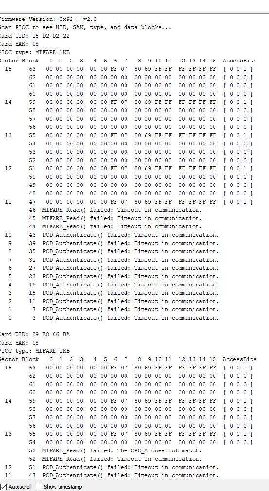

# Entry 4
##### 2/9/20

#### Progress
Similar to my last blog entry, I am continuing to refresh the basic arduino code and learning new code for the Radio-Frequency Identification (RFID) and Liquid-Crystal Display (LCD). For learning the basic code, I was using the [Arduino Reference](https://www.arduino.cc/reference/en/) page where I review functions, like `digitalRead()`, `digitalWrite()`, and `pinMode()`. I was able to review all the basics on Arduino's official website, but I could not find much about RFID and its functions. I went to search on Google and found a reference page for RFID on a website called [neikolban](http://www.neilkolban.com/esp32/docs/cpp_utils/html/class_m_f_r_c522.html#a6f324d43c6fbbd0e260b171747186037). This website gave me many functions that can be used to control the RFID. However, I soon realized that I did not understand many of the terms and acronyms that they were referring to. I was able to learn many of the acronyms on [NFC Research Lab](https://www.nfc-research.at/index.php@id=40.html)'s Reference page. For example, PCD stands for Proximity Coupling Device, which in Arduino would be the MFRC522 and PICC stands for Proximity Inductive Coupling Card, which in Arduino would be the tags and the mastercard.

After learning these functions, I started to program on Arduino's online tool called [Arduino Create](https://create.arduino.cc/) as I prefer the ability to be able to work anywhere and not need to download the many libraries that I need. For instance, I was able to use the example that is provided to find the Unique Identifier (UID) of the PICC by asking my partner, Shuquan to use the Dump Info example.


This is the code in the Dump Info example
```
/*
 * --------------------------------------------------------------------------------------------------------------------
 * Example sketch/program showing how to read data from a PICC to serial.
 * --------------------------------------------------------------------------------------------------------------------
 * This is a MFRC522 library example; for further details and other examples see: https://github.com/miguelbalboa/rfid
 *
 * Example sketch/program showing how to read data from a PICC (that is: a RFID Tag or Card) using a MFRC522 based RFID
 * Reader on the Arduino SPI interface.
 *
 * When the Arduino and the MFRC522 module are connected (see the pin layout below), load this sketch into Arduino IDE
 * then verify/compile and upload it. To see the output: use Tools, Serial Monitor of the IDE (hit Ctrl+Shft+M). When
 * you present a PICC (that is: a RFID Tag or Card) at reading distance of the MFRC522 Reader/PCD, the serial output
 * will show the ID/UID, type and any data blocks it can read. Note: you may see "Timeout in communication" messages
 * when removing the PICC from reading distance too early.
 *
 * If your reader supports it, this sketch/program will read all the PICCs presented (that is: multiple tag reading).
 * So if you stack two or more PICCs on top of each other and present them to the reader, it will first output all
 * details of the first and then the next PICC. Note that this may take some time as all data blocks are dumped, so
 * keep the PICCs at reading distance until complete.
 *
 * @license Released into the public domain.
 *
 * Typical pin layout used:
 * -----------------------------------------------------------------------------------------
 *             MFRC522      Arduino       Arduino   Arduino    Arduino          Arduino
 *             Reader/PCD   Uno/101       Mega      Nano v3    Leonardo/Micro   Pro Micro
 * Signal      Pin          Pin           Pin       Pin        Pin              Pin
 * -----------------------------------------------------------------------------------------
 * RST/Reset   RST          9             5         D9         RESET/ICSP-5     RST
 * SPI SS      SDA(SS)      10            53        D10        10               10
 * SPI MOSI    MOSI         11 / ICSP-4   51        D11        ICSP-4           16
 * SPI MISO    MISO         12 / ICSP-1   50        D12        ICSP-1           14
 * SPI SCK     SCK          13 / ICSP-3   52        D13        ICSP-3           15
 */

#include <SPI.h>
#include <MFRC522.h>

#define RST_PIN         9          // Configurable, see typical pin layout above
#define SS_PIN          10         // Configurable, see typical pin layout above

MFRC522 mfrc522(SS_PIN, RST_PIN);  // Create MFRC522 instance

void setup() {
	Serial.begin(9600);		// Initialize serial communications with the PC
	while (!Serial);		// Do nothing if no serial port is opened (added for Arduinos based on ATMEGA32U4)
	SPI.begin();			// Init SPI bus
	mfrc522.PCD_Init();		// Init MFRC522
	delay(4);				// Optional delay. Some board do need more time after init to be ready, see Readme
	mfrc522.PCD_DumpVersionToSerial();	// Show details of PCD - MFRC522 Card Reader details
	Serial.println(F("Scan PICC to see UID, SAK, type, and data blocks..."));
}

void loop() {
	// Reset the loop if no new card present on the sensor/reader. This saves the entire process when idle.
	if ( ! mfrc522.PICC_IsNewCardPresent()) {
		return;
	}

	// Select one of the cards
	if ( ! mfrc522.PICC_ReadCardSerial()) {
		return;
	}

	// Dump debug info about the card; PICC_HaltA() is automatically called
	mfrc522.PICC_DumpToSerial(&(mfrc522.uid));
}
```

While I was working with Shuquan, the wires connecting the MFRC522 was coming loose and we were unable to find the UID. When Shuquan manually held the wires together and scanned the tags, we were able to get the UID for the tags.



#### Engineering Design Process
We are currently on Step 5: Create a Prototype and approaching Step 6: Test and Evaluate the Prototype on the Engineering Design Process. Shuqun have installed the MFRC522 and I am continuing to build the response of the tags. Even though we are still working on our builds, we will very soon start testing and finish our MVP.

#### Skill/Skills
One skill that I developed was being able to Learn On My Own (LOYO). I had to find proper websites to learn the functions of the RFID. If I did not try to find the the functions, we would not be able to get the UID of each tag. Another skill that I developed was Time Management. I was planning my schedules to give myself enough time to learn. I am currently planning the time for the mid-winter break with Shuquan to get the most time to build and test.

#### Next Steps
As the break is coming up, I want to start finishing my Minimum Viable Product (MVP) and use the break to work with Shuquan and start testing and fixing  issues that we may have. Since the wire keeps falling, we are going to try to find a way to keep the wire attached (possibly using solder). I am going to continue to program the response of the MFRC522 when it detects the tags. For now, it will print something onto the Serial and eventually be able to move the Solenoid lock.

[Previous](entry03.md) | [Next](entry05.md)

[Home](../README.md)