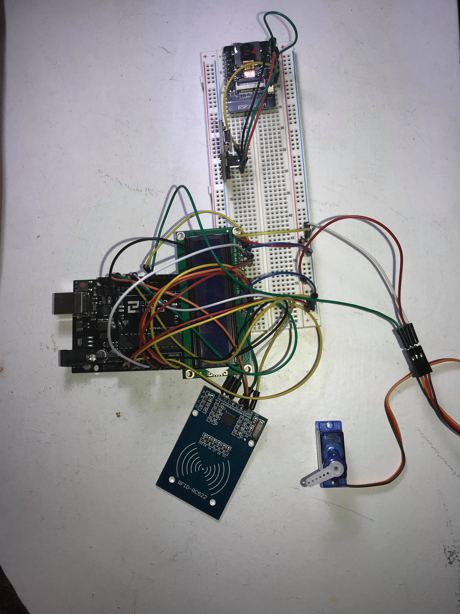

# Entry 6
##### 6/2/20

#### Engineering Design Process
We went back to step 7 to further improve our project by attempting to add additional parts to strength protection. Then, we proceed back to the final step of the process and communicate the results. Our finalized project provides a lock to help residents to protect their homes.

#### Product
From the last blog entry to now, Shuquan and I have been finalizing our Minimum Viable Product (MVP) to create a convenient smart lock system for better home protection. Our MVP is a lock that responds to RFID for convenience as RFID cards would be easier to carry than keys and there will be no locks, which would prevent picking or breaking and blocking trespassers from entering.

 
Shuquan and I have attempted to improve our project further by adding LCD to display an output to give instructions to users. However, our attempts ended with failures as the LCD showed text that was garbled in all the attempts to troubleshoot it. Sadly, the problems did end there because our Bluetooth module and our ESP32-CAM also did not work. Our Bluetooth module was broken in-transit and was not usable. Finally, we researched in ESP32-CAM and found tutorials online. We first went through a video called [Introduction to ESP32 - Getting Started](https://youtu.be/xPlN_Tk3VLQ) to learn more about ESP32 and how to set it up. We got ESP32’s library by following the [Installation instructions using Arduino IDE Boards Manager](https://github.com/espressif/arduino-esp32/blob/master/docs/arduino-ide/boards_manager.md) on Github so that we can code through Arduino IDE. We follow the video at [ESP32 CAM - 10 Dollar Camera for IoT Projects](https://youtu.be/visj0KE5VtY) to learn how to use ESP32-CAM. Although we found the example code and followed the video, we received many errors. Shuquan and I tried to troubleshoot it, search the errors online, and follow the online suggestions; however, in the end, we could not resolve the issue.

#### Skills
Even though our project did not end expectly, we are happy with our MVP and appreciate the learning experiences that we gained through this project. By learning Java in our AP Computer Science A class, we are able understand Arduino code much better as there are many similarities between them. In the future, the Java content that we have learned in class would apply to Arduino code and many other computer languages. Moreover, this project has not only taught us the hard skills of Arduino, but also the soft skills, such as communication, teamwork, and time management. Communication and teamwork are important skills that we have developed over this project. To effectively make our project, communication and teamwork are needed as they help for passing information between our partnership. This project has many parts so time management is also important to be able to create our project over time.

#### Next Steps
Even though our project is "complete", there are many improvements to be made. First, we would want to have all the parts of the project working: LCD, ESP32-CAM, and Bluetooth connection. Bluetooth connection would allow people to access their door from their phone, which increases convenience for the people. Also, the ESP32-CAM would allow a way to identify people and help residents protect their home from strangers. Furthermore, we would also like to implement two-step authentication by combining the different inputs that we have made, like the RFID, Bluetooth, and facial recognition. In the near future, where the situation is better, we would like to rework on this project with new parts and new ideas for more safety and protection.

## _Our Project_

- [Code](https://gist.github.com/wilsonz8427/4857a04508a38569bafa41ad804c16dc)

[Previous](entry05.md) | [Next](entry07.md)

[Home](../README.md)

